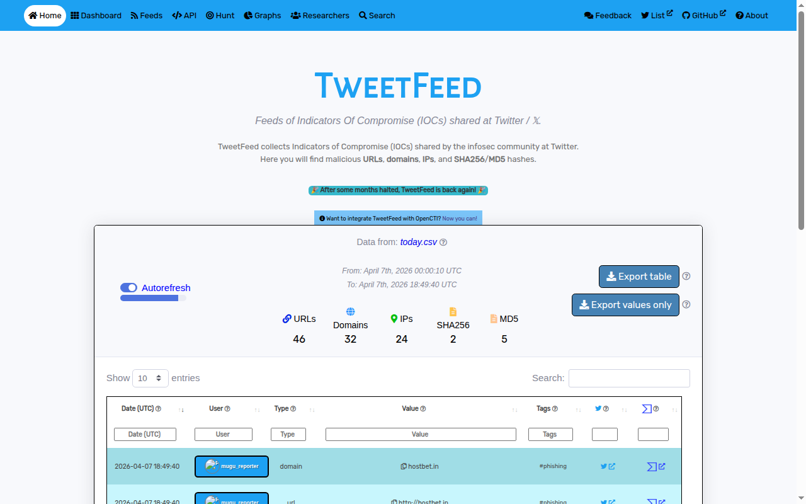

<div align="center">

# TweetFeed

**Crowdsourced IOC feeds from the infosec community on Twitter/X**

[tweetfeed.live](https://tweetfeed.live) &nbsp;|&nbsp; [Feedback](https://tweetfeed.live/feedback.html) &nbsp;|&nbsp; [OpenCTI connector](https://github.com/OpenCTI-Platform/connectors/tree/master/external-import/tweetfeed)

---



---

</div>

## Feeds

<div align="center">

<table>
    <thead>
    </thead>
    <tbody>
    <tr>
        <th colspan=4>2026-04-08 03:05:18 (UTC)</th>
    </tr>
    <tr>
            <th>Today</th>
            <th>Last 7 days</th>
            <th>Last 30 days</th>
            <th>Last 365 days</th>
    </tr>
    <tr>
            <td>:clipboard: <a href="https://github.com/0xDanielLopez/TweetFeed/blob/master/today.csv">Today</a> (<a href="https://raw.githubusercontent.com/0xDanielLopez/TweetFeed/master/today.csv">raw</a>)</td>
            <td>:clipboard: <a href="https://github.com/0xDanielLopez/TweetFeed/blob/master/week.csv">Week</a> (<a href="https://raw.githubusercontent.com/0xDanielLopez/TweetFeed/master/week.csv">raw</a>)</td>
            <td>:clipboard: <a href="https://github.com/0xDanielLopez/TweetFeed/blob/master/month.csv">Month</a> (<a href="https://raw.githubusercontent.com/0xDanielLopez/TweetFeed/master/month.csv">raw</a>)</td>
            <td>:clipboard: <a href="https://github.com/0xDanielLopez/TweetFeed/blob/master/year.csv">Year</a> (<a href="https://raw.githubusercontent.com/0xDanielLopez/TweetFeed/master/year.csv">raw</a>)</td>
     </tr>
    </tbody>
</table>
</div>

### Output format

```json
[
  {
    "date": "2026-04-07 19:21:49",
    "user": "1ZRR4H",
    "type": "domain",
    "value": "googlemeetinterview.help",
    "tags": "",
    "tweet": "https://x.com/1ZRR4H/status/2041698363230327128"
  },
  {
    "date": "2026-04-07 01:51:46",
    "user": "fbgwls245",
    "type": "url",
    "value": "http://6tdqqaxftvradka5d2frzgwixis7fmro7rfh4ettzcx7jfapkebe6jad.onion",
    "tags": "#ransomware",
    "tweet": "https://x.com/fbgwls245/status/2041333078518587563"
  }
]
```

## Statistics

<div align="center">

### Types

| Type | Today | Week | Month | Year |
| :--- | :---: | :---: | :---: | :---: |
| **:link: URLs** | 9 | 462 | 2219 | 64532 |
| **:globe_with_meridians: Domains** | 6 | 350 | 1651 | 41328 |
| **:triangular_flag_on_post: IPs** | 3 | 192 | 708 | 21858 |
| **:1234: SHA256** | 0 | 7 | 44 | 1468 |
| **:1234: MD5** | 0 | 20 | 124 | 3606 |

---

### Tags

| Tag | Today | Week | Month | Year |
| :--- | :---: | :---: | :---: | :---: |
| **#phishing** | 0 | 396 | 1107 | 50825 |
| **#C2** | 0 | 14 | 192 | 30783 |
| **#CobaltStrike** | 0 | 2 | 34 | 8506 |
| **#scam** | 0 | 14 | 46 | 8075 |
| **#malware** | 0 | 15 | 109 | 5651 |
| **#Interactsh** | 0 | 0 | 0 | 2578 |
| **#Remcos** | 0 | 0 | 19 | 2462 |
| **#Sliver** | 0 | 0 | 14 | 2085 |
| **#APT** | 0 | 7 | 80 | 2044 |
| **#NetSupportRAT** | 0 | 0 | 2 | 2012 |
| **#AsyncRAT** | 0 | 2 | 30 | 1881 |
| **#Deimos** | 0 | 0 | 0 | 1531 |
| **#Kimsuky** | 0 | 92 | 801 | 1537 |
| **#Mythic** | 0 | 0 | 0 | 1281 |
| **#Havoc** | 0 | 0 | 2 | 1273 |
| **#Lumma** | 0 | 0 | 23 | 1218 |
| **#ransomware** | 0 | 7 | 35 | 1035 |
| **#stealer** | 0 | 22 | 80 | 864 |
| **#Njrat** | 0 | 0 | 46 | 862 |
| **#Qakbot** | 0 | 0 | 0 | 857 |
| **#Supershell** | 0 | 0 | 0 | 804 |
| **#opendir** | 0 | 20 | 53 | 791 |
| **#Xworm** | 0 | 20 | 33 | 720 |
| **#LummaStealer** | 0 | 0 | 7 | 602 |
| **#Formbook** | 0 | 0 | 0 | 577 |

---

### Top reporters (today)

| Number | User | IOCs | 
| :--- | :---: | :---: | 
| **#1** | [Metemcyber](https://x.com/Metemcyber) | 12 |
| **#2** | [urldna_bot](https://x.com/urldna_bot) | 4 |
| **#3** | [1ZRR4H](https://x.com/1ZRR4H) | 2 |
| **#4** | [-](https://x.com/-) | 0 |
| **#5** | [-](https://x.com/-) | 0 |
| **#6** | [-](https://x.com/-) | 0 |
| **#7** | [-](https://x.com/-) | 0 |
| **#8** | [-](https://x.com/-) | 0 |
| **#9** | [-](https://x.com/-) | 0 |
| **#10** | [-](https://x.com/-) | 0 |

</div>

## How it works

Monitors tweets containing threat-related tags or posted by trusted infosec researchers from a curated [list](https://x.com/i/lists/1423693426437001224). IOCs (URLs, domains, IPs, hashes) are extracted, deduplicated, and published as CSV and RSS feeds updated hourly.

Currently tracking 100+ tags across malware families, C2 frameworks, APT groups, and attack techniques.

## Hunting with Microsoft Defender

<details>
<summary><b>SHA256 hashes (yearly feed)</b></summary>

```kusto
let MaxAge = ago(30d);
let SHA256_whitelist = pack_array(
'XXX' // Some SHA256 hash you want to whitelist.
);
let TweetFeed = materialize (
    (externaldata(report:string)
    [@"https://raw.githubusercontent.com/0xDanielLopez/TweetFeed/master/year.csv"]
    with (format = "txt"))
    | extend report = parse_csv(report)
    | extend Type = tostring(report[2])
    | where Type == 'sha256'
    | extend SHA256 = tostring(report[3])
    | where SHA256 !in(SHA256_whitelist)
    | extend Tag = tostring(report[4])
    | extend Tweet = tostring(report[5])
    | project SHA256, Tag, Tweet 
);
union (
    TweetFeed
    | join (
        DeviceProcessEvents
        | where Timestamp > MaxAge
    ) on SHA256
), (
    TweetFeed
    | join (
        DeviceFileEvents
        | where Timestamp > MaxAge
    ) on SHA256
), ( 
    TweetFeed
    | join (
        DeviceImageLoadEvents
        | where Timestamp > MaxAge
    ) on SHA256
) | project Timestamp, DeviceName, FileName, FolderPath, SHA256, Tag, Tweet
```

</details>

<details>
<summary><b>IP addresses (monthly feed)</b></summary>

```kusto
let MaxAge = ago(30d);
let IPaddress_whitelist = pack_array(
'XXX' // Some IP address you want to whitelist.
);
let TweetFeed = materialize (
    (externaldata(report:string)
    [@"https://raw.githubusercontent.com/0xDanielLopez/TweetFeed/master/month.csv"]
    with (format = "txt"))
    | extend report = parse_csv(report)
    | extend Type = tostring(report[2])
    | where Type == 'ip'
    | extend RemoteIP = tostring(report[3])
    | where RemoteIP !in(IPaddress_whitelist)
    | where not(ipv4_is_private(RemoteIP))
    | extend Tag = tostring(report[4])
    | extend Tweet = tostring(report[5])
    | project RemoteIP, Tag, Tweet 
);
union (
TweetFeed
    | join (
        DeviceNetworkEvents
    | where Timestamp > MaxAge
    ) on RemoteIP
) | project Timestamp, DeviceName, RemoteIP, Tag, Tweet
```

</details>

<details>
<summary><b>URLs and domains (weekly feed)</b></summary>

```kusto
let MaxAge = ago(30d);
let domain_whitelist = pack_array(
'XXX' // Some URL/Domain you want to whitelist.
);
let TweetFeed = materialize (
    (externaldata(report:string)
    [@"https://raw.githubusercontent.com/0xDanielLopez/TweetFeed/master/week.csv"]
    with (format = "txt"))
    | extend report = parse_csv(report)
    | extend Type = tostring(report[2])
    | where Type in('url','domain')
    | extend RemoteUrl = tostring(report[3])
    | where RemoteUrl !in(domain_whitelist)
    | extend Tag = tostring(report[4])
    | extend Tweet = tostring(report[5])
    | project RemoteUrl, Tag, Tweet 
);
union (
TweetFeed
    | join (
        DeviceNetworkEvents
    | where Timestamp > MaxAge
    ) on RemoteUrl
) | project Timestamp, DeviceName, RemoteUrl, Tag, Tweet
```

</details>

## Data and license

All IOC data originates from public tweets by the infosec community. TweetFeed aggregates, structures, and redistributes it - but the data belongs to the community that shares it.

The feeds (CSV, RSS) are freely available for any use, commercial or otherwise, without attribution required.

## Author

Created and maintained by [Daniel López](https://x.com/0xDanielLopez).

If you find this useful, consider giving it a :star: or [buying a coffee](https://www.buymeacoffee.com/dlopez).

---

<div align="center">

**By the community, for the community.**

</div>
